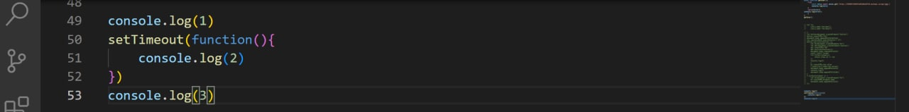
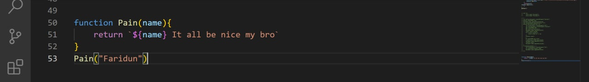
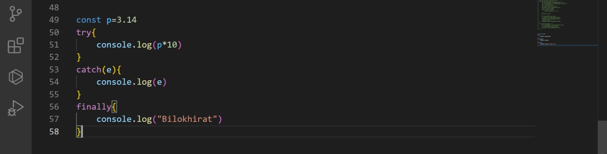

# Synchronous vs Asynchronous programming
# Synchronous
## Synchronous code runs in  sequence. This means that 
## each operation must wait 
## for the previous one to 
## complete before executing

# Asynchronous
## Asynchronous code runs in 
## parallel. This means that an 
## operation can occur while 
## another one is still being 
## processed

# setTimeout()
## The setTimeout() method executes a block 
## of code after the specified time. The 
## method executes the code only once.

## The commonly used syntax of JavaScript 
## setTimeout is:

## Its parameters are
## • function - a function containing a block of code
## • milliseconds - the time after which the function is executed
## The setTimeout() method returns an intervalID, which is a positive integer.
# setTimeout() - Example

# setInterval() - Example

# CallBack
## A function is a block of code that performs a 
## certain task when called. For example,

## In the above program, a string value is passed 
## as an argument to the greet() function.

## In JavaScript, you can also pass a function as 
## an argument to a function. This function that is 
## passed as an argument inside of another 
## function is called a callback function.

# Promise
In JavaScript, a promise is a good way to handle asynchronous operations. It is 
used to find out if the asynchronous operation is successfully completed or not.

A promise may have one of three states.

• Pending
• Fulfilled
• Rejected

A promise starts in a pending state. That means the process is not complete. If 
the operation is successful, the process ends in a fulfilled state. And, if an error 
occurs, the process ends in a rejected state.

For example, when you request data from the server by using a promise, it will 
be in a pending state. When the data arrives successfully, it will be in a fulfilled 
state. If an error occurs, then it will be in a rejected state

# Promise
To create a promise object, we use the Promise() constructor

 constructor takes a function as an argument. The function also 
accepts two functions resolve() and reject().
If the promise returns successfully, the resolve() function is called. And, if an 
error occurs, the reject() function is called)

In the above program, a Promise object is created that takes two functions: resolve() 
and reject(). resolve() is used if the process is successful and reject() is used when an 
error occurs in the promise.

# Try/catch/finally

The try, catch and finally blocks are used to handle exceptions (a type of an 
error). Before you learn about them, you need to know about the types of errors 
in programming.
Types of Errors
In programming, there can be two types of errors in the code:
Syntax Error: Error in the syntax. For example, if you write consol.log('your 
result');, the above program throws a syntax error. The spelling of console is a 
mistake in the above code.
Runtime Error: This type of error occurs during the execution of the program. For 
example,
calling an invalid function or a variable.

# Try/catch/finally

# Async await
We use the async keyword with a function to represent that the function is an 
asynchronous function. The async function returns a promise

The syntax of async function is:

# Async await
The await keyword is used inside the async function to wait for the asynchronous 
operation.

The syntax to use await is

# HTTP = HyperText Transfer Protocol
HTTP (англ. HyperText Transfer Protocol — «протокол передачи гипертекста») — протокол прикладного уровня передачи данных, изначально — в виде гипертекстовых документов в формате HTML, в настоящее время используется для передачи произвольных данных.